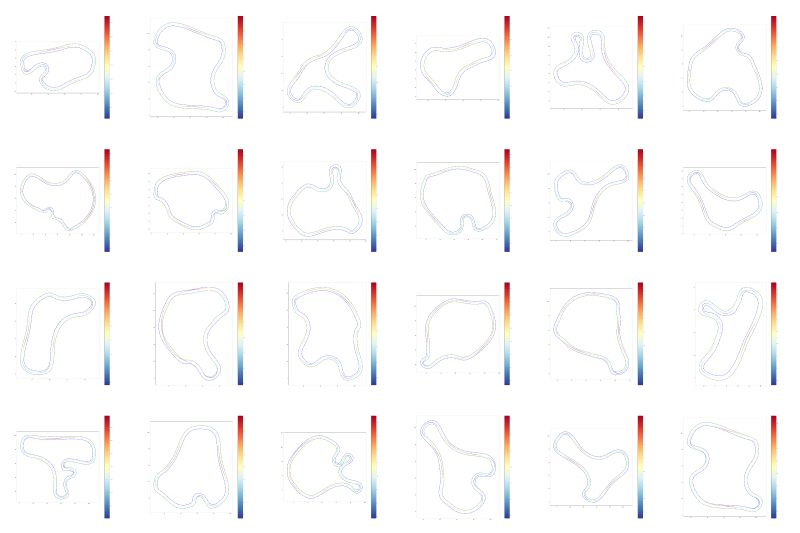

# Generate Circuits with TILKE
TILKE is a python module that allows generating randomized formula circuits.

  
*TILKE Circuits + racing line and velocity profile algorithm by [Albert Rodas](https://www.linkedin.com/in/albert-rodas-6118191ab/)*
## Getting Started
### Python install
Make sure you have a recent enough [python install](https://www.python.org/downloads/) the module has been developed and validated on python 3.9
### Clone the repository
`git clone https://github.com/puigde/TILKE.git`
### Create and activate a virtual environment
For example [using miniconda3](https://docs.conda.io/en/latest/miniconda.html) and then running  
`conda create -n tilke_env python=3.9`  
`conda activate tilke_env`
### Setup the module
`cd TILKE`  
`pip install -e .`
### Tutorial
Take a look at the [tutorial file](tutorial.ipynb)
