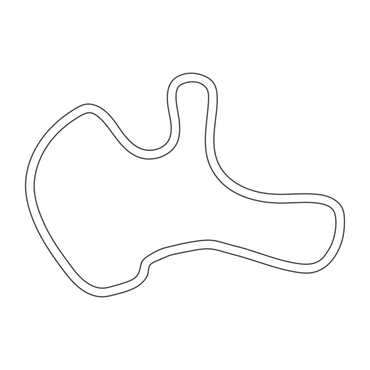
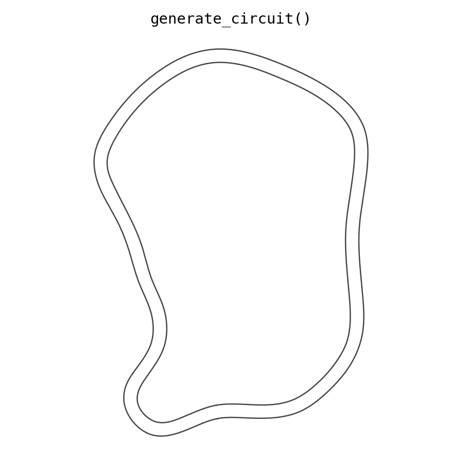
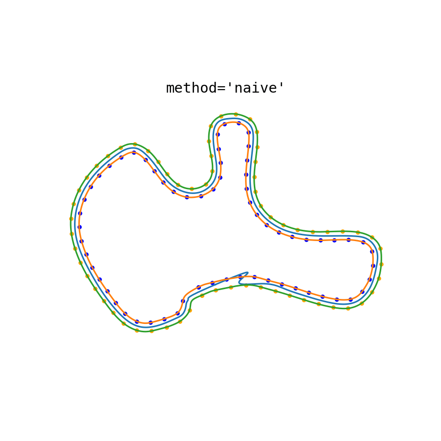
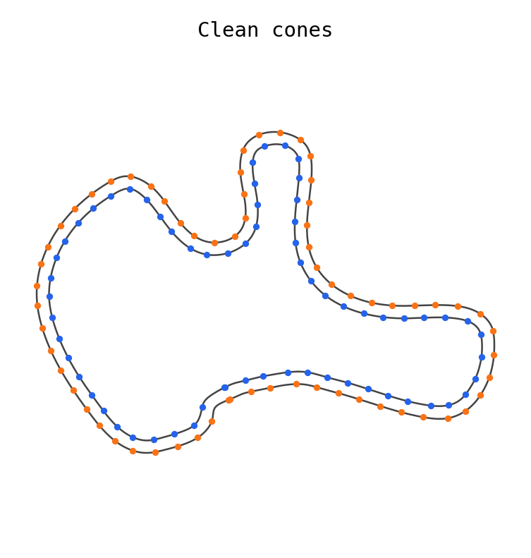

# tilke

Generate randomized Formula-style racing circuits.



## Get started

```bash
pip install .
```

Three lines to your first circuit:

```python
from tilke import generate_circuit, populate_cones, plot_circuit

circuit = generate_circuit()
circuit = populate_cones(circuit)
plot_circuit(circuit)
```



Every call produces a different layout. Pin a seed for reproducibility:

```python
circuit = generate_circuit(seed=1337)
```

## Place cones along the track

Three placement strategies — uniform, Perlin noise offset, or fully random:

```python
circuit = populate_cones(circuit, method="naive")    # uniform spacing
circuit = populate_cones(circuit, method="perlin")   # noise-offset (default)
circuit = populate_cones(circuit, method="random")   # random count per side
```



## Simulate noisy detection

Model real-world cone detection with false negatives (missed cones) and false positives (phantom cones):

```python
from tilke import contaminate_cones

noisy = contaminate_cones(circuit)
```



## Export

```python
from tilke import circuit_to_csv, circuit_to_image

circuit_to_csv(circuit, filename="my_circuit")

circuit_img, track_label, cones_input = circuit_to_image(circuit)
```

Generate a dataset of circuits in one call:

```python
from tilke import get_sample_csv

get_sample_csv(n=100, path="dataset/", contaminated=True)
```

## Customize everything

<details>
<summary>Circuit shape</summary>

```python
from tilke import CurveGeneratorConfig

config = CurveGeneratorConfig(
    num_control_points=10,
    radius=200.0,
    edginess=0.1,
    seed=42,
)
circuit = generate_circuit(curve_config=config)
```

</details>

<details>
<summary>Track constraints</summary>

```python
from tilke import CircuitRestrictions

restrictions = CircuitRestrictions(
    min_curvature_radius_middle_curve=8.0,
    min_curvature_radius_interior_curve=6.0,
    min_interior_exterior_distance=2.0,
)
circuit = generate_circuit(restrictions=restrictions)
```

</details>

<details>
<summary>Cone population</summary>

```python
from tilke import ConePopulationParameters

params = ConePopulationParameters(
    total_number_cones=200,
    false_negative_probability=0.2,
    false_positive_probability=0.1,
)
circuit = populate_cones(circuit, params=params)
noisy = contaminate_cones(circuit, params=params)
```

</details>

<details>
<summary>Track width</summary>

```python
from tilke import TrackParameters

track = TrackParameters(
    distance_between_middle_and_track_sides=3.0,
    stepsize_for_track_generation=0.3,
)
circuit = generate_circuit(track_params=track)
```

</details>

## Development

```bash
uv sync
uv run pytest
uv run ruff check src/ tests/
```

## License

MIT
